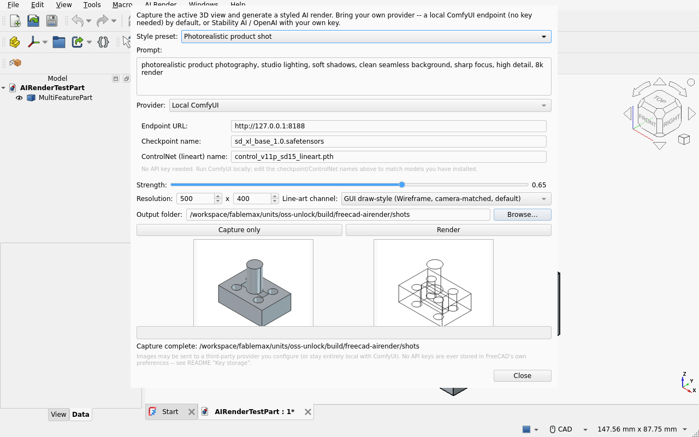
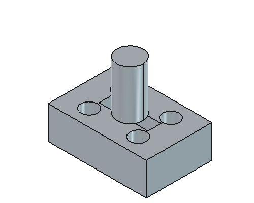
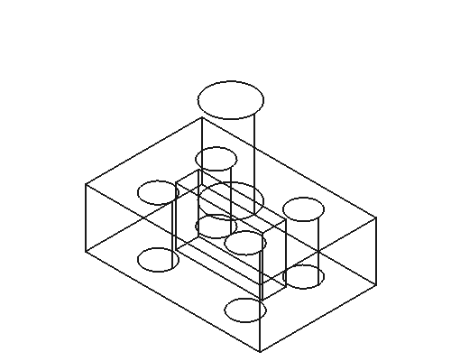
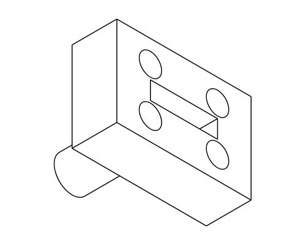

# AI Render for FreeCAD

Stylized AI image rendering for FreeCAD: capture the active 3D viewport
(a color image + a geometry-faithful **line-art control image**), send both
as img2img/ControlNet-style input to a bring-your-own-key image model, and
save the styled result next to your document.

Complements the unmaintained Render workbench: fast/stylized instead of
slow/physically-accurate. No bundled billing, no bundled models - you bring
the provider.

## Quick start

1. Open a document with visible, shape-bearing geometry and frame it in the
   3D view the way you want the render framed.
2. Activate the **AIRender** workbench, run **AI Render...**
3. Pick a provider (local ComfyUI by default - zero cost, no account -
   or Stability AI / OpenAI with your own API key), a style preset or a
   custom prompt, and resolution.
4. **Capture only** lets you preview the color + control images before
   spending any provider credits. **Render** runs the full round trip.

## Line-art channel

AI Render captures two images per run: a plain color viewport screenshot,
and a **control** image that keeps the AI render faithful to your model's
actual geometry (used as ControlNet/img2img conditioning). Two independent
ways to produce that control image are implemented:

- **GUI draw-style (Wireframe) - default.** Switches the live 3D view's
  draw style to `Wireframe`, takes a screenshot, then restores the
  original style. Because it *is* the live 3D view, it is exactly
  camera-matched to the color capture by construction - same framing, same
  resolution, no separate projection math to get wrong.

  Note: this addon originally defaulted to FreeCAD's `Hidden Line` draw
  style, which removes back-facing edges for a cleaner drawing. That mode
  was found (2026-07-10, verified against a real FreeCAD 1.1.0 install)
  to silently render as a **plain shaded image with zero edge lines** on
  software-rendered setups (e.g. Xvfb + llvmpipe, the class of environment
  this addon's own automated verification runs under) - no error, no
  warning, just a wrong picture. `Wireframe` mode was verified to render
  correctly in the same environment (white background, black edges), at
  the cost of also showing hidden/back edges rather than removing them.
  If you're on a real GPU-accelerated FreeCAD install, you can pass
  `mode="Hidden Line"` to `capture.capture_drawstyle_lineart()` yourself
  for a cleaner drawing - just verify it visually on your own machine
  first, since this addon cannot detect the silent-failure mode
  automatically.

- **Vector (`TechDraw.projectToSVG`) - secondary, headless-safe.** Computes
  an exact geometric projection of the document's visible shapes along the
  active camera direction, with no GPU/OpenGL context required at all
  (works under plain `freecadcmd`, no display). Useful for headless
  pipelines. Its projection direction is an approximation of the live
  camera (matched via `ActiveView.getViewDirection()` when available), so
  it is not pixel-identical to the GUI capture the way the draw-style
  channel is - that is why it is the secondary channel rather than the
  default.

  This channel had its own bug, also fixed 2026-07-10: `TechDraw.
  projectToSVG` wraps each group of projected paths in its own SVG
  `transform="scale(1, -1)"`. The old bounding-box computation parsed the
  *raw*, pre-transform path coordinates, so the computed `viewBox` did not
  match what actually got painted, and the rendered PNG was almost
  entirely blank (a tiny sliver of geometry in one corner). The fix wraps
  the whole projected fragment in a single group element and asks Qt's own
  `QSvgRenderer.boundsOnElement()` for that group's real, post-transform
  bounds instead of re-deriving them by hand (per-path queries would not
  work: Qt skips parent transforms in `boundsOnElement`, but a wrapper
  group's bounds do include its descendants' transforms) - robust to
  whatever internal projection frame TechDraw uses. The rasterization step
  also now preserves the projected geometry's aspect ratio (padding the
  shorter axis to match the target width:height) so shapes are not
  non-uniformly stretched, and rescales the stroke width so lines stay
  legible regardless of model size.

Pick the channel per-run from the **Line-art channel** dropdown in the
dialog; your choice is remembered (FreeCAD preferences) as the default for
next time.

## Key storage

API keys are never written to FreeCAD's own preferences. For Stability AI
and OpenAI, point the dialog at a key **file** (read fresh on every call)
or a key **command** (e.g. `pass show stability-ai`) whose stdout is the
key. ComfyUI needs no key at all - it's your own local server.

## Providers

- **ComfyUI** (default) - local, free, no account. Builds an img2img +
  ControlNet(lineart) workflow graph and posts it to your running ComfyUI
  instance.
- **Stability AI** - hosted, BYO API key.
- **OpenAI** (`images.edit`) - a vision-language edit model; a good quick
  style pass, but looser geometry fidelity than the ControlNet-based
  channels above since it isn't given an explicit line-art control image.

## Output

Rendered images and their color/control inputs are saved under
`<document-directory>/airender/` by default (or an unsaved-document
fallback location, surfaced in the dialog's status line - never silent),
next to a `*_request.json` sidecar recording the exact request sent to the
provider for reproducibility/audit.

## Screenshots

| Color capture | Wireframe control (default) | Vector control (secondary) |
|---|---|---|
|  |  |  |

## Known limitations (v1)

- No depth-map control channel (out of v1 scope).
- No public getter for the 3D view's *current* override draw style exists
  on `View3DInventorViewerPy`, so draw-style restoration targets FreeCAD's
  normal `"As Is"` default rather than whatever mode was active before the
  capture ran (flagged here, not hidden).
- `Hidden Line` draw style is verified broken (renders as plain Shaded)
  under software/llvmpipe rendering - see "Line-art channel" above.
