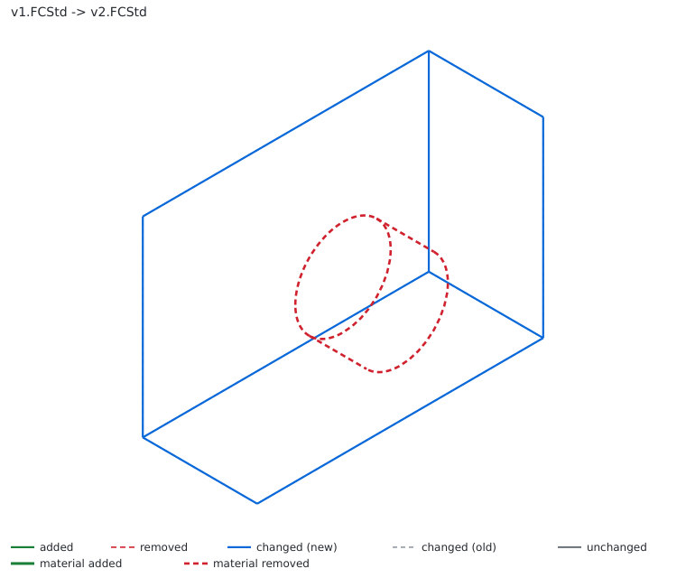

# freecad-diff

Show what changed between two versions of a FreeCAD document. It reads the
feature tree, parameters, sketch constraints and materials from each `.FCStd`
and reports the difference as text, JSON, an SVG overlay of the shapes, or a
self-contained HTML page.

We are trying to build a diff engine for FreeCAD. This is our first attempt.
Detailed feedback is welcome. Send screenshots and errors, we will iterate and
get to something great.



Above: two versions of a part. The pocket drilled in the newer version shows
up as the removed material, outlined in dashed red.

## What it does

- Text diff: features added or removed, a `Length` going from 15 mm to 20 mm,
  a constraint removed, a label renamed, the tip feature changed.
- JSON, for scripts and CI.
- SVG overlay: the old and new shapes drawn together, added in green, removed
  in dashed red, changed in blue over a grey ghost of the old shape. With
  FCDIFF_VOLUME it also outlines the actual material added or removed.
- HTML report: one file, no external files needed, with the overlay, an
  old/new blend slider, and a row per change.

It runs in the GUI, from the command line, and as a git external diff driver
so `git diff` is readable for `.FCStd` files.

## Status

Early. It works headless on FreeCAD 1.1 in our tests, but it has not been
tested on many real projects yet, and the visual overlay in particular needs
more eyes. If it gets something wrong, or the picture looks off, please open an
issue with the two files (or screenshots) and what you expected.

Known limits right now:

- Sketch geometry is matched by position, so inserting an element in the middle
  of a sketch can read as several edited elements.
- The overlay draws one silhouette per top level shape. A body is drawn once,
  not feature by feature.
- Shapes are read per object, so extra placement from Part containers or
  App::Link is not applied in the overlay or the volume numbers yet.

## Install

FreeCAD 1.1 or newer.

Manual install, until it is in the Addon Manager:

```
git clone https://github.com/mathmati/freecad-diff
```

Copy the folder into your FreeCAD `Mod` directory (Addon Manager path, shown in
FreeCAD under Tools, Addon Manager), then restart FreeCAD. A "FreeCAD Diff"
workbench appears in the workbench list.

## Use it (GUI)

In the FreeCAD Diff workbench:

- Diff Against Saved: what changed since the last save.
- Diff Two Files: pick two saved documents and compare them.

Both show a colored summary, with an Export HTML Report button that writes the
visual report. There is a checkbox to number each change with a revision cloud.

## Use it (command line)

Run under FreeCAD's own interpreter. Options are set with environment variables,
because `freecadcmd` takes the real command line for itself:

```
FCDIFF_OLD=v1.FCStd FCDIFF_NEW=v2.FCStd freecadcmd tools/freecad_diff.py

FCDIFF_FORMAT=html FCDIFF_OUTPUT=diff.html \
    freecadcmd tools/freecad_diff.py v1.FCStd v2.FCStd

FCDIFF_FORMAT=svg FCDIFF_OUTPUT=diff.svg \
    freecadcmd tools/freecad_diff.py v1.FCStd v2.FCStd
```

Options: `FCDIFF_FORMAT` (text, json, csv, html, svg), `FCDIFF_COLOR`
(auto, always, never), `FCDIFF_SUMMARY`, `FCDIFF_PALETTE` (default, okabe-ito),
`FCDIFF_VIEWS` (iso, front, top, right), `FCDIFF_CALLOUTS`,
`FCDIFF_TOLERANCE` (ignore value changes below this, e.g. 0.01),
`FCDIFF_VOLUME` (also report added/removed material volume), `FCDIFF_OUTPUT`.

Exit code: 0 no changes, 1 differences found, 2 error.

## Use it (git)

So `git diff` shows changes for `.FCStd` files:

```
git config diff.fcstd.command "freecadcmd /path/to/tools/freecad_diff.py"
echo "*.FCStd diff=fcstd" >> .gitattributes
```

Once that is set up, `git diff` works between any two points in history, not
just the last save:

```
git diff HEAD~5 HEAD -- part.FCStd
git diff main my-branch -- part.FCStd
```

## Related tools

FreeCAD already has version-control tooling, and this is meant to sit next to
it, not replace it:

- History Workbench does in-app visual and tree comparison with a review
  workflow. If you want to review changes inside FreeCAD, use that.
- freecad-git and WebTools Git commit and pull FreeCAD files with git.
- fcinfo (in FreeCAD's source) dumps a file's properties as text for git.

What this tool adds is a headless diff that names which property changed and
its old and new value (Pad.Length 15 mm to 22 mm, a constraint added, an
expression changed), between any two versions, as text, CSV, JSON, SVG or
HTML, from the command line or a git driver. That part is not covered by the
tools above.

## How it works

Both files are read into the same JSON model of the document (see
[`SCHEMA.md`](SCHEMA.md)), and the diff is a comparison of that JSON. The visual
overlay projects each shape to 2D line art with TechDraw, headless, and styles
the old and new versions so they read at a glance.

## License

MIT. See `LICENSE`.
