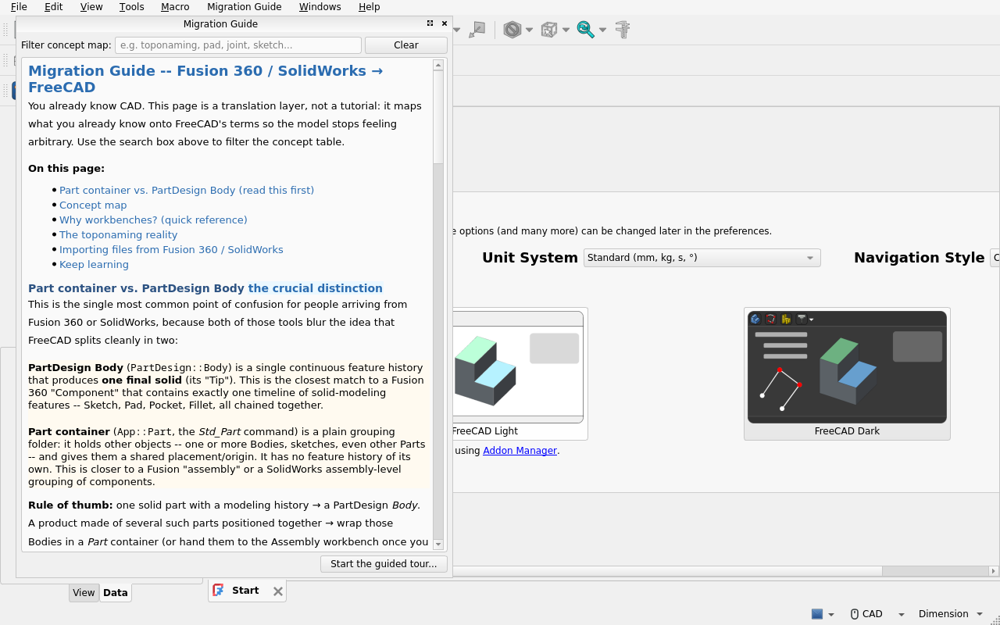
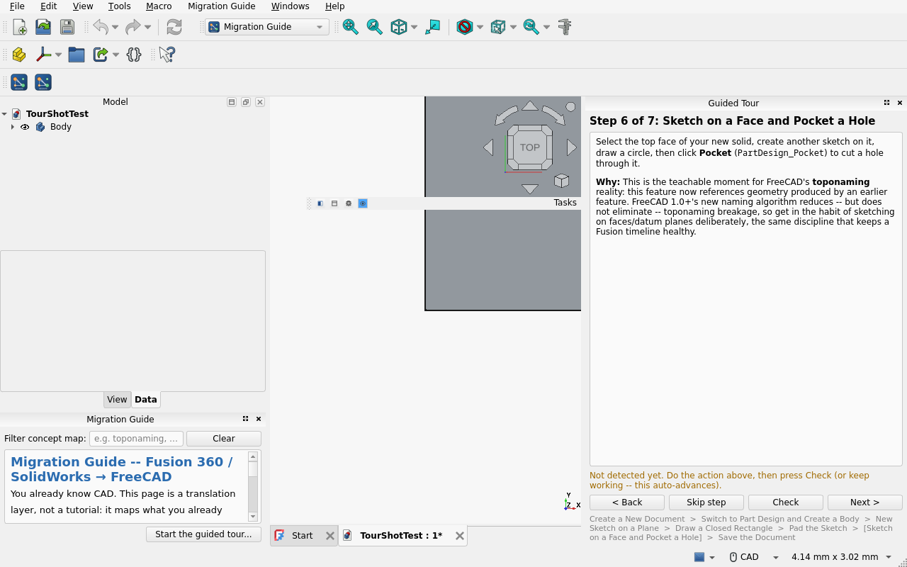

# FreeCAD Migration Guide

A FreeCAD 1.1 workbench that helps people coming from **Fusion 360 or
SolidWorks** (or other commercial CAD) get productive in FreeCAD quickly. It
does two things, and deliberately nothing else:

1. **Migration Guide** — a dockable, searchable concept-map panel that
   translates what you already know into FreeCAD's terms.
2. **Guided Tour** — a 7-step, hands-on walkthrough of FreeCAD's core
   PartDesign workflow (sketch → pad → pocket → save), validated against your
   live document as you go.

Screenshots (captured on FreeCAD 1.1.0, Linux):

| Migration Guide panel | Guided Tour panel |
|---|---|
|  |  |

## Who this is for

Anyone who already knows parametric CAD (Fusion 360, SolidWorks, Onshape,
etc.) and is switching to FreeCAD, and finds the terminology and workflow
unfamiliar even though the underlying ideas are the same. It assumes you know
what a sketch, an extrude, and a constraint are — it does not teach CAD from
scratch.

## What it is NOT (explicit scope)

- **Not a first-run configuration wizard.** FreeCAD 1.1 already ships its own
  "Welcome to FreeCAD" first-start screen (language, unit system, theme,
  navigation style) — this addon does not duplicate it, does not write to
  `Mod/Start` preferences, and links out to FreeCAD's own preferences UI
  (`Std_AddonMgr` / "Open First Start Setup") for anything in that scope.
- **Not a Sketcher constraint tutor.** Detailed, step-validated teaching of
  Sketcher constraints is explicitly handed off to the FPA-funded interactive
  Sketcher-tutorial project (Amrita Vishwa Vidyapeetham team; funding
  confirmed in the FreeCAD Project Association's Dec 2024 grants
  announcement and 2024 annual report, USD 6,000 over 9 months). As of this
  writing (2026-07) we found no shipped repository, Addon Index listing, or
  forum announcement for it — this addon's tour is written to hand off
  cleanly to that project's scope (Sketcher constraint pedagogy) whenever it
  ships, and to degrade gracefully (no broken link, no dead promise) if it
  doesn't. This addon's tour draws a simple closed rectangle and moves on to
  Pad/Pocket — it does not re-teach constraint tools.
- **See also, different job.** For live best-practices feedback on a Part
  you're already building (not migration-specific), see the community
  [FreeCAD-Beginner-Assistant](https://github.com/alekssadowski95/FreeCAD-Beginner-Assistant)
  addon (live in the Addon Index) — it's a retrospective critique of work
  already done, not a migration guide or a fixed guided tour, so it solves a
  different, complementary problem.
- **Not an assembly/Joints tutorial**, not a file-format converter, not a
  theme or preference-pack manager.

## Features

### 1. Migration Guide panel

A dockable panel (left dock area) with:

- A **Part container vs. PartDesign Body** explainer — the single most common
  point of confusion for Fusion/SolidWorks refugees.
- A **concept map** (Timeline → tree, Joint → Assembly workbench, Extrude →
  Pad, Collinear → Tangent, etc.), filterable by keyword.
- A **workbench quick-reference** ("if you want to do X, switch to workbench
  Y").
- An honest note on **toponaming** — FreeCAD 1.0+'s naming algorithm reduces
  but does not eliminate broken references, with the datum-plane habit that
  mitigates it.
- **Import guidance**: FreeCAD cannot open `.f3d`/`.sldprt` natively — export
  STEP/IGES from the source app instead.
- Links out to the FreeCAD wiki's migration page, a Fusion→FreeCAD video
  series, the community "CAD Rosetta Stone" wiki stub, and (for anyone
  missing a ribbon-style toolbar) the FreeCAD-Ribbon addon via the Addon
  Manager — never vendored.

Opens automatically the first time you activate any real workbench after
installing (governed by this addon's own `Mod/MigrationGuideWB` parameter
group — it never touches FreeCAD's own first-run flag), and can be reopened
any time from the **Migration Guide** menu/toolbar.

### 2. Guided Tour

A dockable panel (right dock area) that walks through building one real
PartDesign part end to end:

1. Create a new document
2. Switch to Part Design and create a Body
3. New sketch on a plane
4. Draw a closed rectangle
5. Pad the sketch
6. Sketch on a face and Pocket a hole
7. Save the document

Each step explains **what** to do and **why**, in Fusion/SolidWorks terms
where useful. The tour checks your live document state (not your clicks) to
tell whether a step is done, auto-advances when it detects progress, and
every step has an explicit **Skip step** button so it never traps you. There
is no coach-mark/spotlight overlay in this version — see "Known limitations"
below.

## Install

### Via the Addon Manager (once indexed / added as a custom repository)

`Tools → Addon manager` → search for "Migration Guide" (after this addon is
indexed), or add this repository's URL under **Addon Manager → Configure →
Custom repositories** for early access before it is indexed. Restart FreeCAD,
then check **View → Workbenches → Migration Guide**.

### Manually (developer / local test install)

Copy (do not symlink, if you want to reproduce exactly what the Addon Manager
does) this folder into your FreeCAD `Mod/` directory:

- Linux: `~/.local/share/FreeCAD/Mod/` (or `~/.local/share/FreeCAD/v1-1/Mod/`
  on some 1.1 installs)
- Windows: `%APPDATA%\FreeCAD\Mod\`
- macOS: `~/Library/Application Support/FreeCAD/Mod/`

Restart FreeCAD and check **View → Workbenches**.

## Requirements

- FreeCAD 1.1.0 or later (developed and tested against 1.1.0; see
  `package.xml`'s `<freecadmin>`).
- No additional Python dependencies. No network access of any kind — this
  addon makes zero outbound connections; the only "links out" are plain
  clickable URLs a human chooses to open in their own browser.

## Privacy / compliance

This addon collects no telemetry, sends no data anywhere, and stores nothing
except two small local preference values (whether you've seen the welcome
panel, and which tour step you're on) under its own
`User parameter:BaseApp/Preferences/Mod/MigrationGuideWB` group. It never
reads or writes FreeCAD's own `Mod/Start` first-run parameters.

## Known limitations / roadmap

- **i18n readiness: not yet translation-wrapped.** All UI strings are
  currently plain Python string literals rather than wrapped in
  `FreeCAD.Qt.translate` / `QT_TRANSLATE_NOOP`. This is a known gap, not an
  oversight — translation-wrapping the full concept-map/tour copy and
  shipping `.ts`/`.qm` files is scoped as the next content pass before an
  Addon Index submission is finalized, per the Qualities checklist's i18n
  guidance.
- **No coach-mark / spotlight overlay.** The tour is a text+validation panel,
  not a highlight-the-button overlay. FreeCAD has no public "product tour"
  API to build on; a highlight overlay was evaluated and deferred as brittle
  across themes/DPI/FreeCAD versions (see `SPEC.md` §6.3 in this addon's
  design record). Contributions welcome.
- **No bundled third-party addons.** This addon vendors nothing; it links out
  to FreeCAD-Ribbon via a plain Addon Manager reference only (the FPA
  Sketcher-tutorial project has no shipped repository or Addon Index listing
  as of 2026-07, so there is nothing to link to yet — see "What it is NOT"
  above), and degrades gracefully (i.e. simply doesn't link) if FreeCAD-Ribbon
  ever leaves the Addon Index.
- The Assembly-workbench note in the concept map flags known upstream
  solver/joint-drag rough edges rather than hiding them — this addon aims to
  set accurate expectations, not oversell FreeCAD's current maturity.

## License

Code is MIT-licensed — see [`LICENSE`](LICENSE). The manifest
(`package.xml`) declares the same SPDX identifier consistently.

## Contributing

Issues and pull requests are welcome once this repository is public (see
`RELEASE_CHECKLIST.md` for what's still pending before that). Please:

- Keep new UI strings translation-ready (`FreeCAD.Qt.translate`).
- Keep icons SVG-only; never commit compiled Qt resources (`.rcc`).
- Disclose any AI assistance in your PR description and with an
- If you're extending the tour past PartDesign basics into Sketcher
  constraint teaching, please coordinate with the FPA Sketcher-tutorial
  addon team first rather than duplicating their scope.
