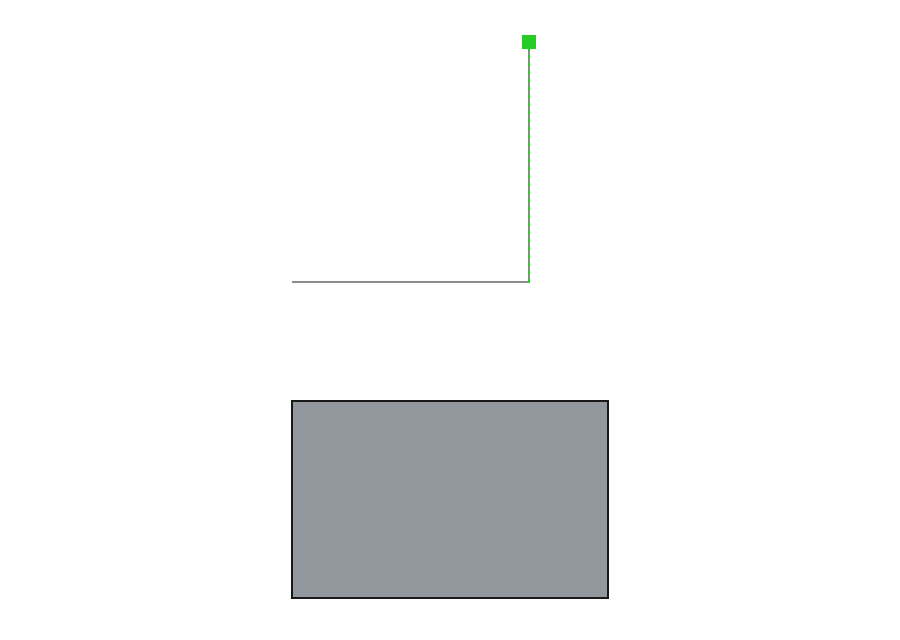
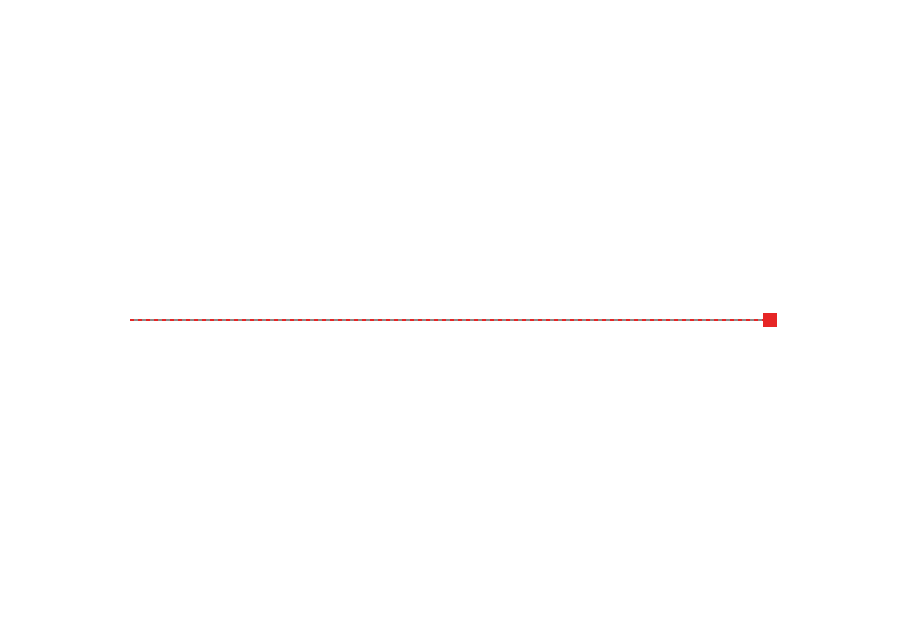

# SketchLayer for FreeCAD

SketchUp-style inline drawing for FreeCAD: draw a **line/polyline** or a
**rectangle** directly in the 3D view — on the working plane or a selected
planar face — with SketchUp-style **colored inference cues** and inline
**type-to-dimension**. Close a loop and you get a lightweight planar face,
ready to extrude with the companion **PushPull** addon.

## Why

FreeCAD's built-in **Draft** workbench already has a strong, SketchUp-inspired
snapping engine (endpoint, midpoint, perpendicular, parallel, intersection,
extension, on-axis, and more) and can draw on a model face. What it does *not*
have is the part of SketchUp that makes drawing feel effortless: **colored,
categorized on-screen inference feedback**, a **floating value box** you type
into as you draw, and an immediate **loose face** you can push/pull. SketchLayer
adds exactly that thin perception/UX layer on top of FreeCAD's own geometry —
it does **not** reimplement Draft's snapping.

## What it does

- **Colored inference HUD.** As you move the cursor, SketchLayer shows a
  colored cue for the strongest inference relative to what you're drawing:
  - **red** — aligned to the working plane's first axis ("on red axis"),
  - **green** — aligned to the second axis ("on green axis"),
  - **magenta** — parallel or perpendicular to the segment you just drew,
  - **green dot** — on an existing path point (so you can close the loop).
  The inference also *locks the point onto that line*, so a near-aligned
  cursor snaps exactly onto the axis/parallel — like SketchUp.
- **Type-to-dimension (floating value box).** Start a segment and type a
  length, or `W,H` for a rectangle, then press Enter — the exact dimension is
  applied. No focus change, no dialog.
- **Draw on a face.** Select a planar face before starting and SketchLayer
  aligns the drawing plane to it; otherwise it draws on the global XY plane.
- **Makes a Push/Pull-ready face.** Closing a rectangle or polyline creates a
  standalone planar `Part` face — exactly the input the companion
  [PushPull](https://github.com/mathmati/FreeCAD-PushPull) addon extrudes into
  a solid. Draw a rectangle, then push it up: the SketchUp loop.
- **Reuses Draft's snapper.** For snaps to *existing model geometry*,
  SketchLayer consults FreeCAD's own `Snapper` (with its monochrome glyph
  suppressed so only the colored HUD shows); the deterministic
  ray/plane intersection is the fallback.

## Quick start

1. Open (or create) a document. Optionally select a planar face to draw on.
2. Activate the **SketchLayer** workbench and pick **Line** or **Rectangle**.
3. Click points in the 3D view. Watch the colored cues; type a length / `W,H`
   for exact sizes. Close the loop (click the start point, or press Enter).
4. A planar face appears. Switch to **Push/Pull** and drag it into a solid.

Esc cancels at any time, leaving the document unchanged.

## Scope (v1) and honest limitations

- **Tools:** Line/polyline and Rectangle. (Circle/arc/offset are future work.)
- **Drawing plane:** a selected planar face, or the global XY plane. It does
  not yet follow the *hovered* face automatically, nor use an arbitrary Draft
  working plane — pick the face first.
- **Draw-on-face does not split the B-rep.** Like Draft (and unlike SketchUp),
  drawing on an existing face produces an independent face on that plane; it
  does not subdivide the underlying solid's face. That behavior is the biggest
  remaining SketchUp gap and is deliberately out of v1 scope.
- **Object snapping** to model geometry is best-effort via Draft's `Snapper`;
  the drawing-relative inference (axis/parallel/perpendicular/endpoint) is the
  part SketchLayer implements and verifies itself.
- **Inference categories:** on-axis (U/V), parallel, perpendicular, and
  path-endpoint. Midpoint/tangent and multi-inference arbitration are future
  work.

## Screenshots

Colored inference captured live from a real FreeCAD 1.1 3D view (looking down
at the XY plane):

| Green V-axis (perpendicular) | Red U-axis | Magenta parallel | Committed face |
|---|---|---|---|
|  |  |  |  |

## Verification

Checked against a real FreeCAD 1.1 install: the workbench and both commands
auto-register with zero Report-View errors; the colored inference HUD renders
the **correct color per category** (verified at the pixel level —
red/green/magenta); a closed rectangle commits a single planar face of the
expected area; and a headless (`freecadcmd`) regression exercises the
inference resolver, face builder, and the full draw state machine including
typed dimensions and the coplanarity guard. The live drawing is driven through
SketchLayer's Gui-decoupled `DrawController` — the same object the
mouse/keyboard callbacks drive.

## License

Code is MIT (see `LICENSE-Code` and the SPDX headers).
